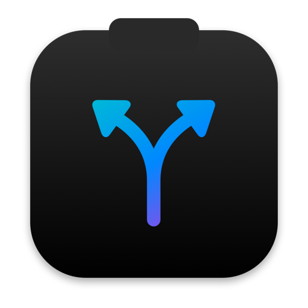
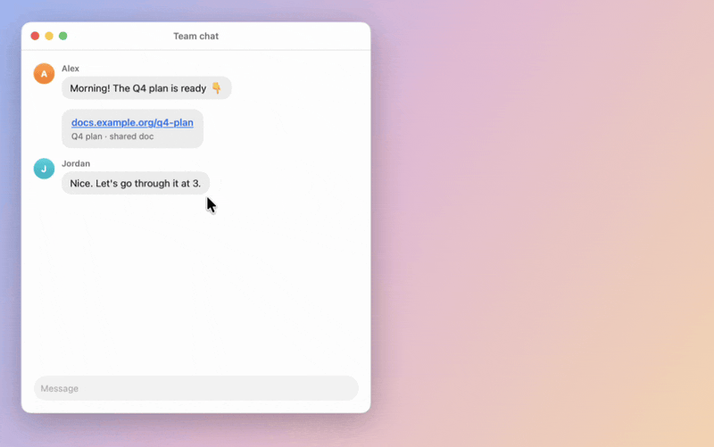
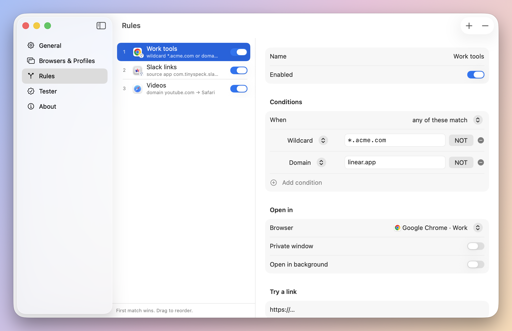
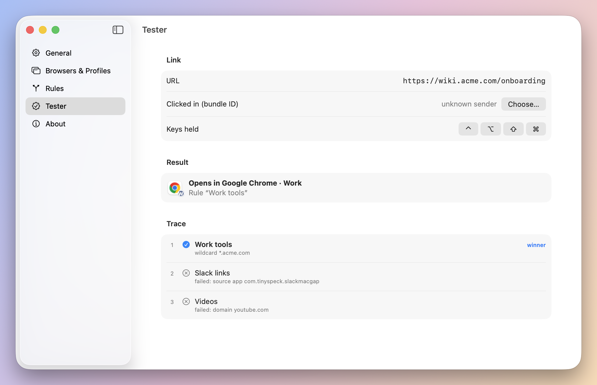
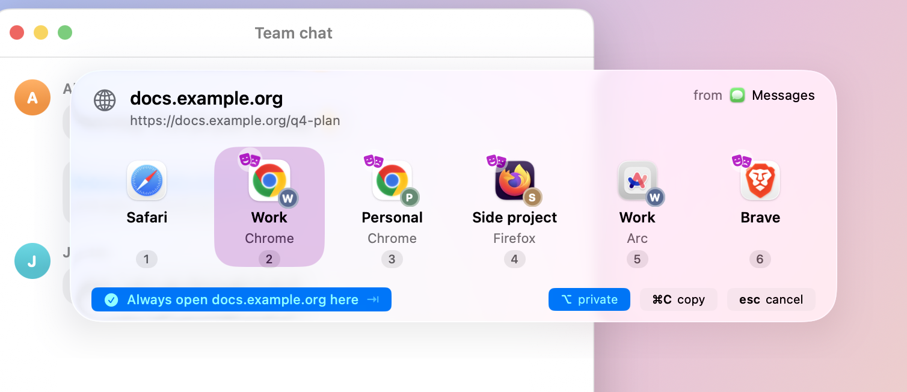
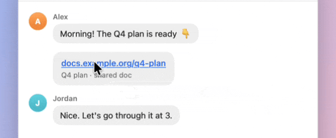

<div align="center">



# BrowserBro

**Every link opens in the right browser and profile.**

[](https://github.com/sergchil/browserbro/releases/latest)
[](https://github.com/sergchil/browserbro/releases)

[](LICENSE)

<picture>
  <source media="(prefers-color-scheme: dark)" srcset="docs/media/hero-dark.gif">
  
</picture>

[Website](https://sergchil.github.io/browserbro/) · [Download](https://github.com/sergchil/browserbro/releases/latest)

</div>

## The problem

You click a work link. It opens in your personal browser. Again.

BrowserBro becomes your default browser. A rule sends each link to the right browser and profile. No rule? A picker opens at your pointer. Press a number.

## Install

| | |
|---|---|
| 🍺 Homebrew | `brew install --cask sergchil/tap/browserbro` |
| ⚡ Terminal | `curl -fsSL https://raw.githubusercontent.com/sergchil/browserbro/main/scripts/install.sh \| bash` |
| 📦 Download | [BrowserBro.dmg](https://github.com/sergchil/browserbro/releases/latest/download/BrowserBro.dmg) · [BrowserBro.zip](https://github.com/sergchil/browserbro/releases/latest/download/BrowserBro.zip) |

macOS 26 or later, Apple silicon. Then open Settings and click **Set as Default Browser…**

<details>
<summary>Downloaded it? First open takes 3 steps</summary>

1. macOS says it cannot verify BrowserBro. Click **Done**.
2. Open **System Settings → Privacy & Security** and click **Open Anyway**.
3. Enter your password and click **Open**.

Why: the app is not notarized (Apple charges $99 a year). Homebrew and the Terminal line skip this.
</details>

## Tour

<table>
<tr>
<td width="50%">
<picture>
  <source media="(prefers-color-scheme: dark)" srcset="docs/media/rules-dark.png">
  
</picture>
<b>Rules.</b> Domain, wildcard, regex, source app, held key. First match wins.
</td>
<td width="50%">
<picture>
  <source media="(prefers-color-scheme: dark)" srcset="docs/media/tester-dark.png">
  
</picture>
<b>Tester.</b> Paste a link, see which rule wins and why.
</td>
</tr>
<tr>
<td width="50%">
<picture>
  <source media="(prefers-color-scheme: dark)" srcset="docs/media/keys-dark.png">
  
</picture>
<b>Profiles.</b> Chrome, Brave, Edge, Vivaldi, Firefox, Zen, Arc, Safari.
</td>
<td width="50%">
<picture>
  <source media="(prefers-color-scheme: dark)" srcset="docs/media/pulse-dark.gif">
  
</picture>
<b>Pulse.</b> A rule fired? A tiny note shows where the link went.
</td>
</tr>
</table>

## Keys

| Key | In the picker |
|---|---|
| <kbd>1</kbd>–<kbd>9</kbd> | Open there |
| <kbd>←</kbd> <kbd>→</kbd> <kbd>Return</kbd> | Move, then open |
| <kbd>⌥</kbd> | Private window |
| <kbd>Tab</kbd> | Always open this site here |
| <kbd>⌘</kbd><kbd>C</kbd> | Copy the link |
| <kbd>Esc</kbd> | Never mind |

**Bro tip:** your rules live in `~/Library/Application Support/BrowserBro/rules.json`. Back it up.

<details>
<summary>Build from source</summary>

Needs Xcode 26 or Swift 6.2. No paid Apple account.

```bash
git clone https://github.com/sergchil/browserbro.git
cd browserbro
scripts/build-app.sh --install   # build, ad-hoc sign, copy to /Applications
swift test
```

| Path | What |
|---|---|
| `Sources/RoutingCore` | Rules and matching |
| `Sources/BrowserBro` | The app |
| `Sources/bro` | `bro test <url>` CLI |
| `site/` | Website |

Release: push a tag `vX.Y.Z`. The `Release` workflow publishes the DMG and ZIP. Then bump the cask in [sergchil/homebrew-tap](https://github.com/sergchil/homebrew-tap).
</details>

<div align="center">
<sub>No network calls, no accounts, no analytics. <a href="LICENSE">MIT</a>. Built because the wrong browser kept winning. 🤙</sub>
</div>
